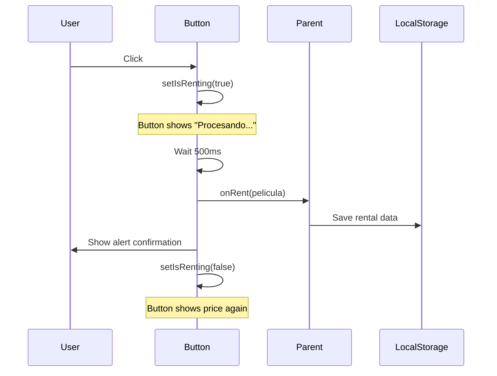

## Overview

`AlquilerButton` (exported as `RentalButton` in source) is a button component that handles movie rental transactions. It displays the rental price, simulates a processing delay, and provides feedback to the user.

## Import

```javascript
import RentalButton from '../components/AlquilerButton';
// Note: Component is internally named RentalButton
```

## Props

<ParamField path="pelicula" type="object" required>
  Movie object containing rental information
  
  **Required properties:**
  - `title` (string): Movie title (used in confirmation message)
  - `alquilerPrecio` (number): Rental price in currency units
</ParamField>

<ParamField path="onRent" type="function" required>
  Callback function invoked when the rental process completes
  
  **Signature:** `(pelicula: object) => void`
  
  **Parameters:**
  - `pelicula` (object): The movie object that was rented
</ParamField>

## Component Signature

```javascript
const RentalButton = ({ pelicula, onRent }) => { ... }
```

## Internal State

<ResponseField name="isRenting" type="boolean">
  Tracks whether a rental transaction is in progress. When `true`, the button displays "Procesando..." and is disabled.
</ResponseField>

## Features

### Simulated Transaction

Simulates a 500ms rental processing delay:

```javascript
const handleRent = () => {
  setIsRenting(true);
  
  // Simular proceso de alquiler
  setTimeout(() => {
    onRent(pelicula);
    setIsRenting(false);
    alert(`Has alquilado ${pelicula.title} por S/ ${pelicula.alquilerPrecio} por 48 horas`);
  }, 500);
};
```

### Loading State

Button text and disabled state change during processing:

```javascript
<button 
  className="alquiler-button"
  onClick={handleRent}
  disabled={isRenting}
>
  {isRenting ? 'Procesando...' : `Alquilar por S/ ${pelicula.alquilerPrecio}`}
</button>
```

### User Feedback

Displays an alert with rental confirmation:

```javascript
alert(`Has alquilado ${pelicula.title} por S/ ${pelicula.alquilerPrecio} por 48 horas`);
```

## Usage Example

<Tabs>
  <Tab title="In Detail Page">
    ```javascript
    import React, { useState } from 'react';
    import RentalButton from '../components/AlquilerButton';

    const PeliculaDetailPage = () => {
      const [alquileres, setAlquileres] = useState([]);
      
      const pelicula = {
        id: 1,
        title: "Inception",
        alquilerPrecio: 3.99
      };

      const handleRent = (rentedPelicula) => {
        const newAlquileres = [
          ...alquileres, 
          { 
            ...rentedPelicula, 
            alquilerDate: new Date().toISOString() 
          }
        ];
        setAlquileres(newAlquileres);
        localStorage.setItem('alquileres', JSON.stringify(newAlquileres));
      };

      return (
        <div>
          <h1>{pelicula.title}</h1>
          <RentalButton pelicula={pelicula} onRent={handleRent} />
        </div>
      );
    };
    ```
  </Tab>
  <Tab title="Basic Usage">
    ```javascript
    import React from 'react';
    import RentalButton from '../components/AlquilerButton';

    const SimpleRental = () => {
      const movie = {
        title: "The Matrix",
        alquilerPrecio: 2.99
      };

      const handleRent = (pelicula) => {
        console.log('Rented:', pelicula.title);
      };

      return <RentalButton pelicula={movie} onRent={handleRent} />;
    };
    ```
  </Tab>
</Tabs>

## Rendered Structure

```jsx
<button 
  className="alquiler-button"
  onClick={handleRent}
  disabled={isRenting}
>
  {isRenting ? 'Procesando...' : 'Alquilar por S/ 3.99'}
</button>
```

## Button States

| State | Text | Disabled | Behavior |
|-------|------|----------|----------|
| Idle | `Alquilar por S/ {price}` | false | Clickable, starts rental |
| Processing | `Procesando...` | true | Not clickable, rental in progress |

## Rental Flow



## CSS Classes

- `.alquiler-button` - Main button element

## Currency Format

The component uses Peruvian Soles (S/) in the button text and alert message:

```javascript
`Alquilar por S/ ${pelicula.alquilerPrecio}`
`Has alquilado ${pelicula.title} por S/ ${pelicula.alquilerPrecio} por 48 horas`
```

## Rental Duration

The alert message indicates a 48-hour rental period (hardcoded in the alert).

## Source Location

`src/components/AlquilerButton.jsx:3`