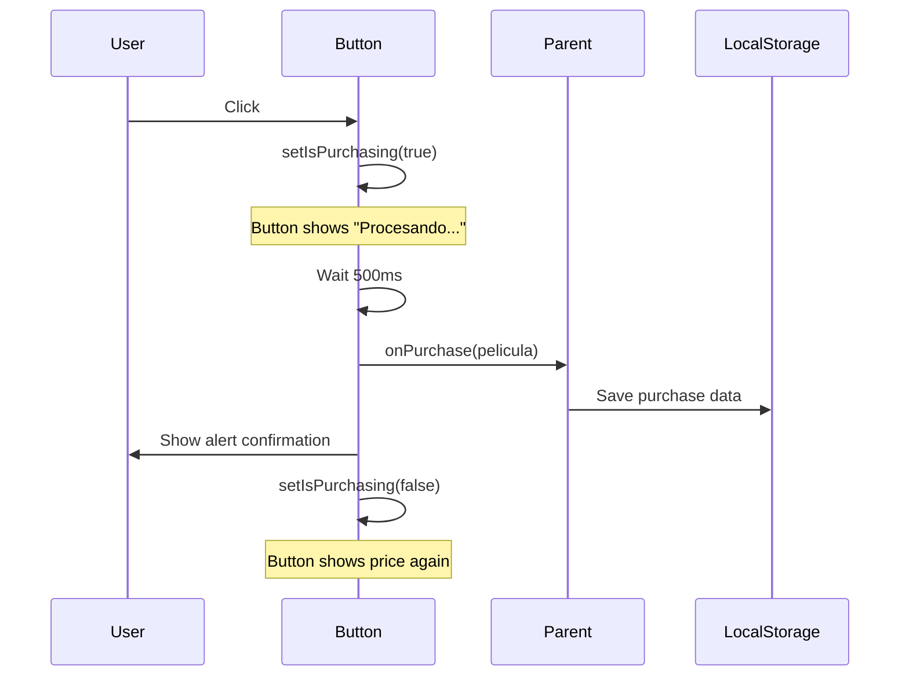

## Overview

`CompraButton` (exported as `PurchaseButton` in source) is a button component that handles movie purchase transactions. It displays the purchase price, simulates a processing delay, and provides feedback to the user.

## Import

```javascript
import PurchaseButton from '../components/CompraButton';
// Note: Component is internally named PurchaseButton
```

## Props

<ParamField path="pelicula" type="object" required>
  Movie object containing purchase information
  
  **Required properties:**
  - `title` (string): Movie title (used in confirmation message)
  - `price` (number): Purchase price in currency units
</ParamField>

<ParamField path="onPurchase" type="function" required>
  Callback function invoked when the purchase process completes
  
  **Signature:** `(pelicula: object) => void`
  
  **Parameters:**
  - `pelicula` (object): The movie object that was purchased
</ParamField>

## Component Signature

```javascript
const PurchaseButton = ({ pelicula, onPurchase }) => { ... }
```

## Internal State

<ResponseField name="isPurchasing" type="boolean">
  Tracks whether a purchase transaction is in progress. When `true`, the button displays "Procesando..." and is disabled.
</ResponseField>

## Features

### Simulated Transaction

Simulates a 500ms purchase processing delay:

```javascript
const handlePurchase = () => {
  setIsPurchasing(true);
  
  // Simular proceso de compra
  setTimeout(() => {
    onPurchase(pelicula);
    setIsPurchasing(false);
    alert(`¡Has comprado ${pelicula.title} por ${pelicula.price}€!`);
  }, 500);
};
```

### Loading State

Button text and disabled state change during processing:

```javascript
<button 
  className="compra-button"
  onClick={handlePurchase}
  disabled={isPurchasing}
>
  {isPurchasing ? 'Procesando...' : `Comprar por ${pelicula.price}€`}
</button>
```

### User Feedback

Displays an alert with purchase confirmation:

```javascript
alert(`¡Has comprado ${pelicula.title} por ${pelicula.price}€!`);
```

## Usage Example

<Tabs>
  <Tab title="In Detail Page">
    ```javascript
    import React, { useState } from 'react';
    import PurchaseButton from '../components/CompraButton';

    const PeliculaDetailPage = () => {
      const [compras, setCompras] = useState([]);
      
      const pelicula = {
        id: 1,
        title: "Inception",
        price: 12.99
      };

      const handlePurchase = (compradaPelicula) => {
        const newCompras = [
          ...compras, 
          { 
            ...compradaPelicula, 
            compraDate: new Date().toISOString() 
          }
        ];
        setCompras(newCompras);
        localStorage.setItem('compras', JSON.stringify(newCompras));
      };

      return (
        <div>
          <h1>{pelicula.title}</h1>
          <PurchaseButton pelicula={pelicula} onPurchase={handlePurchase} />
        </div>
      );
    };
    ```
  </Tab>
  <Tab title="Basic Usage">
    ```javascript
    import React from 'react';
    import PurchaseButton from '../components/CompraButton';

    const SimplePurchase = () => {
      const movie = {
        title: "The Matrix",
        price: 9.99
      };

      const handlePurchase = (pelicula) => {
        console.log('Purchased:', pelicula.title);
      };

      return <PurchaseButton pelicula={movie} onPurchase={handlePurchase} />;
    };
    ```
  </Tab>
</Tabs>

## Rendered Structure

```jsx
<button 
  className="compra-button"
  onClick={handlePurchase}
  disabled={isPurchasing}
>
  {isPurchasing ? 'Procesando...' : 'Comprar por 12.99€'}
</button>
```

## Button States

| State | Text | Disabled | Behavior |
|-------|------|----------|----------|
| Idle | `Comprar por {price}€` | false | Clickable, starts purchase |
| Processing | `Procesando...` | true | Not clickable, purchase in progress |

## Purchase Flow



## CSS Classes

- `.compra-button` - Main button element

## Currency Format

The component uses Euros (€) in the button text and alert message:

```javascript
`Comprar por ${pelicula.price}€`
`¡Has comprado ${pelicula.title} por ${pelicula.price}€!`
```

<Note>
  There's a currency inconsistency in the application: `CompraButton` uses Euros (€) while `AlquilerButton` uses Peruvian Soles (S/).
</Note>

## Comparison with AlquilerButton

| Feature | CompraButton | AlquilerButton |
|---------|-------------|----------------|
| Currency | Euros (€) | Peruvian Soles (S/) |
| Price prop | `pelicula.price` | `pelicula.alquilerPrecio` |
| Duration | Permanent | 48 hours |
| Callback | `onPurchase` | `onRent` |
| Class name | `.compra-button` | `.alquiler-button` |

## Source Location

`src/components/CompraButton.jsx:3`