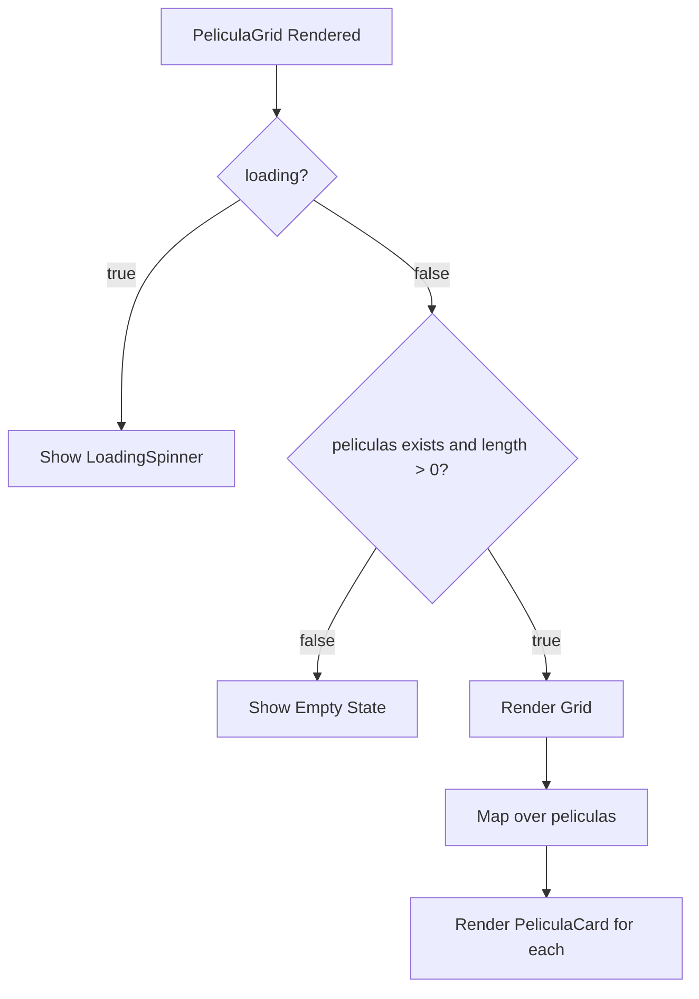

## Overview

`PeliculaGrid` is a container component that renders a responsive grid of `PeliculaCard` components. It handles loading states and empty results scenarios.

## Import

```javascript
import PeliculaGrid from '../components/PeliculaGrid';
```

## Props

<ParamField path="peliculas" type="array" required>
  Array of movie objects to display in the grid. Each movie object should contain all properties required by `PeliculaCard`.
</ParamField>

<ParamField path="loading" type="boolean" required>
  Indicates whether movies are currently being loaded/filtered. When `true`, displays a loading spinner instead of the grid.
</ParamField>

## Component Signature

```javascript
const PeliculaGrid = ({ peliculas, loading }) => { ... }
```

## Conditional Rendering

### Loading State

When `loading` is `true`, renders the `LoadingSpinner` component:

```javascript
if (loading) {
  return <LoadingSpinner />;
}
```

### Empty State

When the `peliculas` array is empty or null, displays an empty state message:

```javascript
if (!peliculas || peliculas.length === 0) {
  return (
    <div className="pelicula-grid__empty">
      <p className="pelicula-grid__empty-text">No se encontraron películas</p>
    </div>
  );
}
```

### Grid State

When movies are available, renders them in a grid layout:

```javascript
<div className="pelicula-grid">
  {peliculas.map(pelicula => (
    <PeliculaCard key={pelicula.id} pelicula={pelicula} />
  ))}
</div>
```

## Usage Example

<Tabs>
  <Tab title="With Hook">
    ```javascript
    import React from 'react';
    import PeliculaGrid from '../components/PeliculaGrid';
    import usePeliculaSearch from '../hooks/usePeliculaSearch';

    const PeliculasPage = () => {
      const { filteredPeliculas, loading } = usePeliculaSearch();

      return (
        <div>
          <h1>Catálogo de Películas</h1>
          <PeliculaGrid peliculas={filteredPeliculas} loading={loading} />
        </div>
      );
    };
    ```
  </Tab>
  <Tab title="With Static Data">
    ```javascript
    import React from 'react';
    import PeliculaGrid from '../components/PeliculaGrid';
    import { mockPeliculas } from '../data/mockPeliculas';

    const StaticGrid = () => {
      return <PeliculaGrid peliculas={mockPeliculas} loading={false} />;
    };
    ```
  </Tab>
</Tabs>

## Behavior Flow



## CSS Classes

- `.pelicula-grid` - Main grid container
- `.pelicula-grid__empty` - Empty state container
- `.pelicula-grid__empty-text` - Empty state message text

## Dependencies

- `react` - Core React library
- `PeliculaCard` - Individual movie card component
- `LoadingSpinner` - Loading indicator component

## Performance Considerations

- Uses `pelicula.id` as the React key for optimal reconciliation
- No internal state management - purely presentational
- Efficient re-rendering based on prop changes only

## Source Location

`src/components/PeliculaGrid.jsx:5`